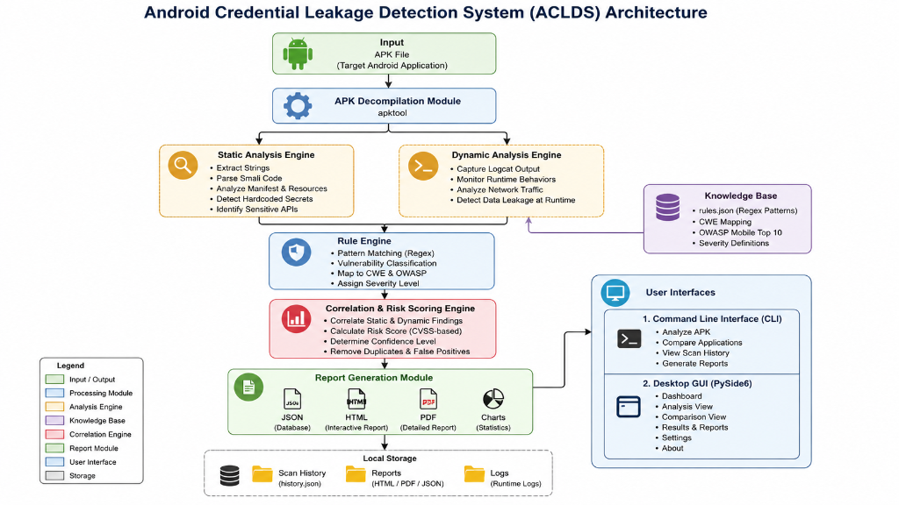
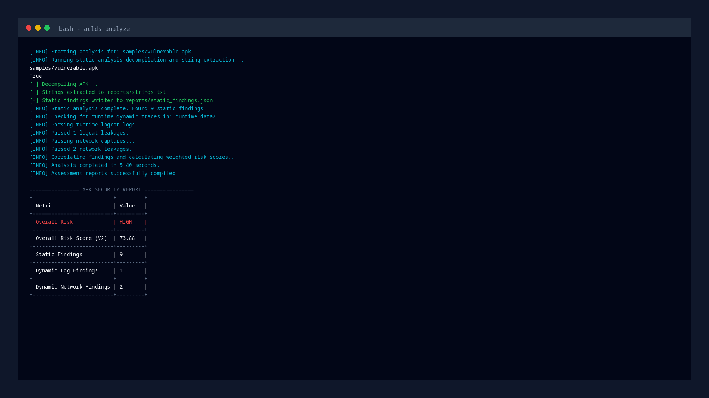
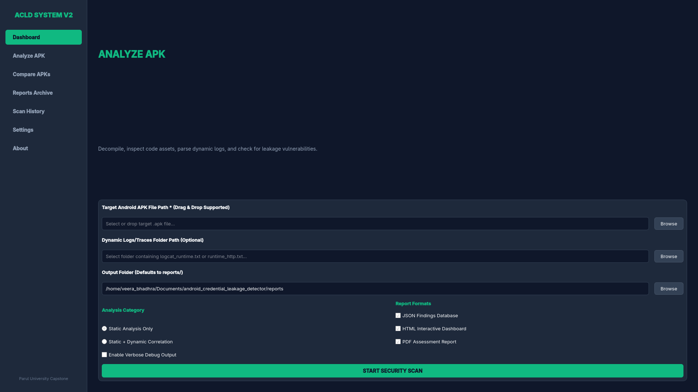
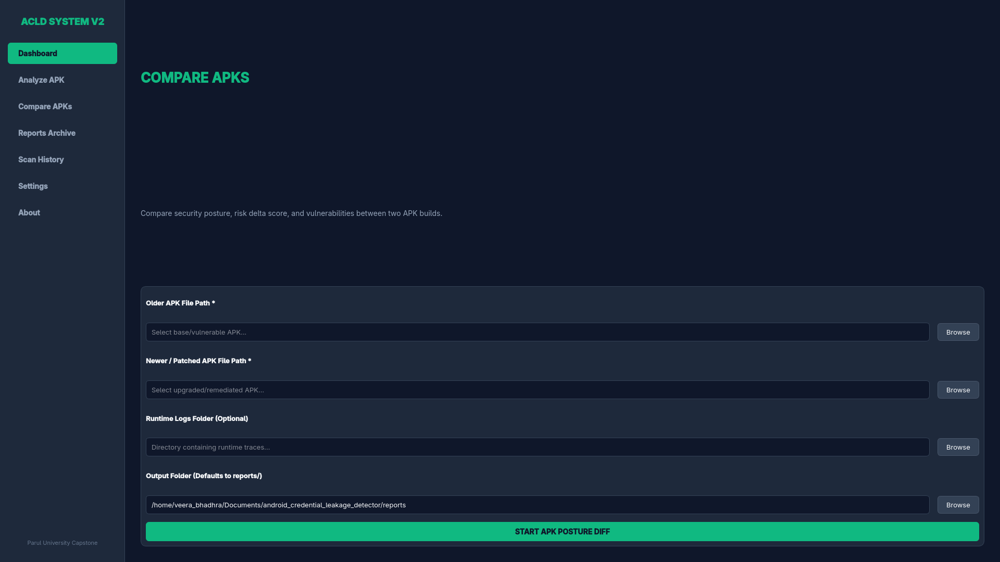
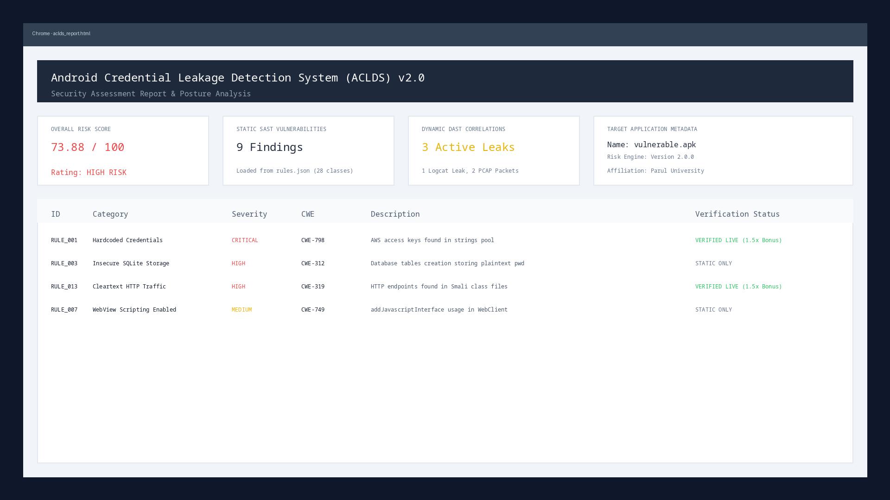

# Android Credential Leakage Detection System (ACLDS) v2.0.0

[](#)
[](#)
[](#)

An intelligent, hybrid risk-weighted Android security analysis framework designed to identify, verify, and score credential leakage, insecure local storage patterns, and weak network configurations using correlated static and dynamic analysis.

Designed and developed as a Final Year Project for **Parul University**, Vadodara, Gujarat, India.

---

## Key Features

- **Static Analysis (SAST)**: APK decompilation via `apktool`, walking resource XML tables (`strings.xml`), and traversing Smali bytecode for hardcoded keys.
- **Dynamic Analysis (DAST)**: Lightweight logcat parser and network packet log captures scanning for session headers, bearer tokens, cookies, and cleartext transmissions.
- **Correlation Engine**: Reconciles SAST findings against live dynamic leaks, validating active exposures with a $1.5\times$ dynamic evidence score multiplier.
- **Externalized Rule base**: Configurable `rules.json` loaded dynamically, containing 28 vulnerability classes mapped to **OWASP Mobile Top 10** and **MITRE CWE**.
- **Build Comparison Engine**: Diff analysis comparing baseline and patched reports, calculating score deltas and posture improvement percentages.
- **Dual Interfaces**: High-speed console Command Line Interface (CLI) and PySide6 Desktop GUI.
- **Multi-Format Reporting**: Generates JSON databases, styled HTML dashboards, and ReportLab PDF assessment summaries.

---

## Repository Structure

```text
android-credential-leakage-detector/
├── correlation/
│   ├── __init__.py
│   └── correlation.py          (correlate findings & scoring, compare reports)
├── dynamic_analysis/
│   ├── __init__.py
│   ├── parse_logcat.py         (improved runtime log parsing)
│   └── parse_pcap.py           (improved network capture parsing)
├── static_analysis/
│   ├── __init__.py
│   ├── analyze_apk.py          (coordinates decompilation & scanning)
│   ├── decompile.py
│   ├── detect_credentials.py    (enriched rule-matching scan)
│   ├── extract_strings.py       (decompiles & walks files)
│   └── vuln_definitions.py     (dynamic rules loader & fallback)
├── utils/
│   ├── __init__.py
│   ├── logger.py               (centralized logging setup)
│   └── report_generator.py     (HTML/PDF generator & matplotlib charting)
├── ui/                         (PySide6 Desktop GUI stacked pages)
│   ├── __init__.py
│   ├── mainwindow.py
│   ├── dashboard.py
│   ├── analyze.py
│   └── compare.py
├── screenshots/
│   └── github/                 (GitHub assets only, no sharing with paper)
│       ├── architecture.png
│       ├── cli_*.png
│       ├── gui_*.png
│       ├── charts.png
│       └── html_report.png
├── research/                   (academic publications & templates)
│   ├── paper/                  (LaTeX, Word docx, Markdown manuscripts)
│   │   ├── paper.tex
│   │   ├── paper.pdf
│   │   ├── paper.docx
│   │   ├── paper.md
│   │   ├── paper_bib.txt
│   │   ├── appendix.md
│   │   └── revision_report.md
│   ├── figures/                (IEEE paper figures only)
│   │   ├── architecture.png
│   │   ├── cli_*.png
│   │   ├── gui_*.png
│   │   ├── charts.png
│   │   └── html_report.png
│   ├── ieee_template/          (original IEEE templates)
│   │   └── conference-template-a4.docx
│   ├── datasets/               (empty placeholder for datasets)
│   └── experiments/            (empty placeholder for logs/pcap runs)
├── rules.json                  (externalized detection engine rules)
├── owasp_mapping.json          (OWASP Mobile Top 10 mappings database)
├── main.py                     (main CLI entrypoint)
├── gui.py                      (main GUI launcher entrypoint)
├── pyproject.toml              (PEP 621 python packaging definition)
└── README.md
```

---

## Installation & Setup

### 1. Prerequisites
- **Python 3.10+**
- **apktool** installed and available in your environment's system `PATH`.
  ```bash
  apktool --version
  ```

### 2. Setup and Install CLI
Clone the repository and install it in editable mode inside a virtual environment:
```bash
git clone https://github.com/kvr585/android-credential-leakage-detector
cd android-credential-leakage-detector

python3 -m venv .venv
source .venv/bin/activate  # On Windows: .venv\Scripts\activate

# Install the package and CLI dependencies
pip install -e .
```

Verify that the `aclds` command is registered system-wide:
```bash
aclds --help
```

---

## Usage Guide

### CLI Application

#### 1. Interactive Wizard Mode
Launch the menu wizard by running:
```bash
aclds
```

#### 2. APK Analysis Mode
Analyze a target APK and optional logcat/HTTP network dumps:
```bash
aclds analyze samples/vulnerable.apk runtime_data/ --output reports/
```

#### 3. APK Posture Comparison Mode
Compare two builds of the same app to calculate security improvements:
```bash
aclds compare samples/vulnerable.apk samples/InsecureBankv2.apk --output reports/
```

#### 4. Audit History Logs
Print a tabular summary of past security scans:
```bash
aclds history
```

### Desktop GUI (PySide6)
Start the PySide6 Desktop GUI:
```bash
aclds gui
```
*Note: The GUI operates asynchronously using background subprocesses, keeping the main interface responsive during decompilation.*

---

## Screenshots & Visuals

### Framework Architecture

*Figure 1: Overall System Architecture and Pipe-and-Filter data pipeline.*

### Command Line Interface (CLI) Analysis

*Figure 2: High-throughput CLI output summary showing correlated risk scores and findings categories.*

### Desktop GUI (PySide6) Dashboard

*Figure 3: PySide6 Desktop Graphical User Interface main dashboard.*

### Desktop GUI (PySide6) Analyze Workspace

*Figure 4: Asynchronous analysis page executing apktool and regex scanning.*

### Desktop GUI (PySide6) APK Comparison Deltas

*Figure 5: Build-to-build comparative metrics and posture change visualizations.*

### Matplotlib Findings & Severity Splits

*Figure 6: Generated Matplotlib graphics mapping categories and severity distributions.*

### Interactive HTML Assessment Report

*Figure 7: Self-contained, responsive HTML interactive report dashboard.*

---

## Technical Performance Profile

Local executions on a benchmark A4 dataset show the following runtime and memory statistics:
- **Static Scan & Decompilation**: 5.42 seconds (Memory: ~142 MB JVM)
- **Dynamic Parsing**: 0.014 seconds (Memory: <1 MB heap)
- **Correlation & Scoring**: 0.001 seconds (Memory: <1 MB heap)
- **Report Generation (HTML/PDF)**: 1.26 seconds (Memory: ~2.22 MB Python heap)

---

## Troubleshooting

1. **`apktool: command not found`**: Ensure java JRE/JDK is installed and apktool binary path is added to environment `PATH`.
2. **Platform Plugin Errors**: If executing on headless Linux servers:
   ```bash
   export QT_QPA_PLATFORM=offscreen
   ```

---

## Acknowledgements
Thanks to the Department of Cyber Security and the Capstone Project Committee at **Parul University**, Vadodara, Gujarat, India, for their guidance, support, and resources.

## License
MIT Academic License. Developed for research and educational purposes.
