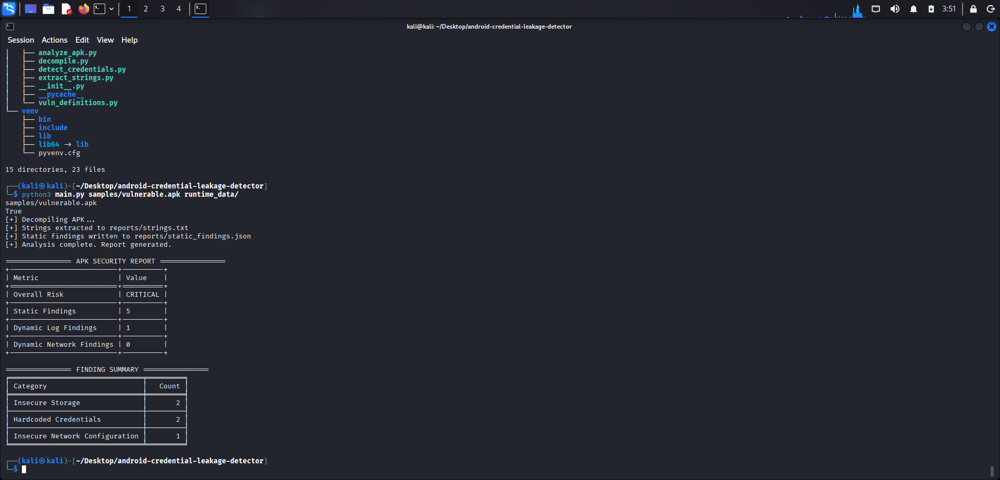
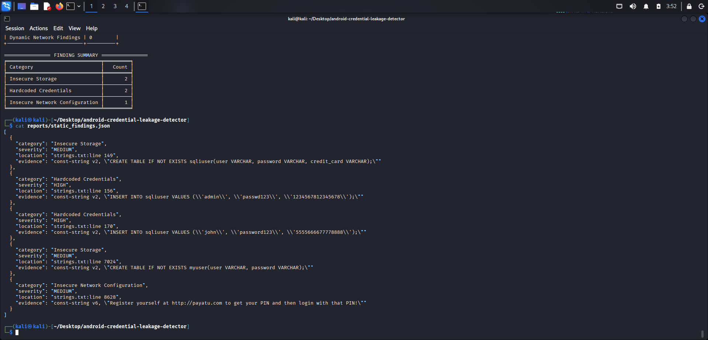
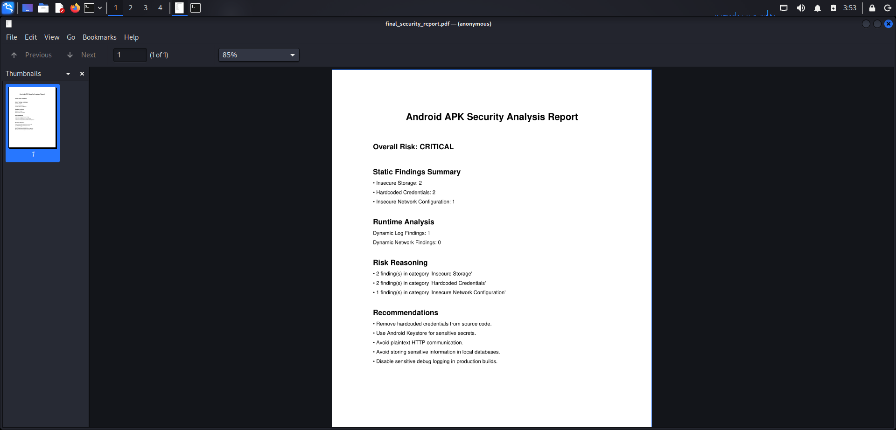

# Android Credential Leakage Detector

A modular Android APK security analysis framework designed to identify credential exposure, insecure storage patterns, weak network configurations, and runtime security risks using static and dynamic analysis techniques.

## Overview

The framework analyzes Android APK files using:

- Static APK inspection
- Runtime evidence analysis
- Correlation-based risk evaluation

It is intended as a developer-oriented command-line security assessment tool for academic, research, and learning purposes.

## Features

### Static Analysis

- APK decompilation using Apktool
- String extraction from `strings.xml` and Smali bytecode
- Hardcoded credential detection
- Sensitive token identification
- Insecure storage pattern detection
- Weak network configuration checks
- Structured JSON finding generation

### Dynamic Analysis

- Runtime log analysis
- Runtime HTTP evidence parsing
- Runtime credential leakage detection
- Safe execution when runtime evidence is unavailable (analysis is skipped with a clear message)

### Correlation Engine

- Correlates static and runtime findings
- Escalates application risk based on combined evidence
- Produces an overall application risk assessment

### Reporting

- JSON security reports
- Terminal summary tables (via Tabulate)
- Exportable PDF security assessment reports (ReportLab)

## Architecture

```text
APK
  ↓
Static Analysis
  ├── APK Decompilation
  ├── String Extraction
  ├── Credential Detection
  └── Network Configuration Checks
  ↓
Runtime Analysis
  ├── Logcat Parsing
  └── Runtime HTTP Analysis
  ↓
Correlation Engine
  ↓
Risk Scoring
  ↓
JSON + PDF Reporting
```

## Project Structure

```text
android-credential-leakage-detector/
├── correlation/
│   ├── __init__.py
│   └── correlation.py
├── dynamic_analysis/
│   ├── __init__.py
│   ├── parse_logcat.py
│   └── parse_pcap.py
├── static_analysis/
│   ├── __init__.py
│   ├── analyze_apk.py
│   ├── decompile.py
│   ├── detect_credentials.py
│   ├── extract_strings.py
│   └── vuln_definitions.py
├── runtime_data/
│   ├── logcat_runtime.txt
│   └── runtime_http.txt
├── reports/
│   ├── generate_pdf.py
│   ├── final_risk_report.json          (generated)
│   ├── static_findings.json            (generated)
│   └── final_security_report.pdf       (generated)
├── samples/
│   └── vulnerable.apk
├── main.py
├── requirements.txt
└── README.md
```

## Technologies Used

- Python 3
- Apktool (CLI, on your `PATH`)
- ReportLab (PDF reports)
- Tabulate (terminal tables)
- JSON
- Regex-based heuristic analysis

## Installation

### Clone the repository

```bash
git clone https://github.com/kvr585/android-credential-leakage-detector.git
cd android-credential-leakage-detector
```

### Create and activate a virtual environment

```bash
python3 -m venv venv
```

On Linux or macOS:

```bash
source venv/bin/activate
```

On Windows (PowerShell or Command Prompt):

```bash
venv\Scripts\activate
```

### Install dependencies

```bash
pip install -r requirements.txt
pip install tabulate reportlab
```

Ensure the `apktool` command is available in your environment (for example, [Kali Linux](https://www.kali.org/) or a distribution where Apktool is installed and on `PATH`).

## Usage

## Analysis Execution

Run the main analyzer with the path to an APK and a directory that may contain runtime artifacts:

```bash
python3 main.py samples/vulnerable.apk runtime_data/
```



The second argument is the runtime data directory. The tool looks for:

- `logcat_runtime.txt`
- `runtime_http.txt`

If either file is missing, the corresponding dynamic analysis step is skipped safely.

### Generate PDF Security Report

After `main.py` has produced `reports/final_risk_report.json`, generate the PDF:

```bash
python3 reports/generate_pdf.py
```

This writes `reports/final_security_report.pdf`.

## Example Findings

The framework can identify:

- Hardcoded credentials
- Sensitive storage patterns
- Plain HTTP usage
- Runtime credential exposure
- Insecure application behavior indicators

### Static Analysis Findings



Findings are written to `reports/static_findings.json` with entries that include category, severity, location (string source line reference), and evidence text.

## Generated Reports

| Report | Path |
|--------|------|
| Static findings | `reports/static_findings.json` |
| Final risk summary | `reports/final_risk_report.json` |
| PDF security report | `reports/final_security_report.pdf` |

### PDF Security Report Preview



Open `reports/final_security_report.pdf` after running `reports/generate_pdf.py` to review overall risk, static summary counts, runtime finding counts, risk reasoning, and recommendations.

Example shape of `reports/final_risk_report.json`:

```json
{
  "overall_risk": "HIGH",
  "static_summary": {
    "Hardcoded Credentials": 2
  },
  "static_findings_count": 2,
  "dynamic_logcat_findings_count": 0,
  "dynamic_network_findings_count": 0,
  "risk_reasoning": [
    "2 finding(s) in category 'Hardcoded Credentials'"
  ]
}
```

## Design Principles

- Static analysis is the primary inspection method
- Runtime analysis is evidence-based only
- No artificial findings are generated
- Missing runtime artifacts are handled safely
- Findings are categorized and severity-tagged

## Limitations

- Heuristic-based analysis
- Regex-driven detection
- Runtime analysis depends on externally captured runtime artifacts
- Encrypted traffic is not analyzed
- No Android runtime instrumentation

## Future Improvements

- Permission-risk correlation
- Advanced runtime instrumentation
- Confidence scoring system
- HTML dashboard reporting
- Enhanced heuristic detection

## Intended Users

- Android security students
- Cybersecurity researchers
- Developers performing APK security checks

## Disclaimer

This project is developed strictly for educational and research purposes and is not intended to replace commercial mobile security assessment platforms.

## Author

Veera bhadhra

## Sample Workflow

```text
APK Input
  ↓
Static APK Analysis
  ↓
Runtime Evidence Parsing
  ↓
Correlation Engine
  ↓
Risk Evaluation
  ↓
JSON + PDF Security Reports
```
