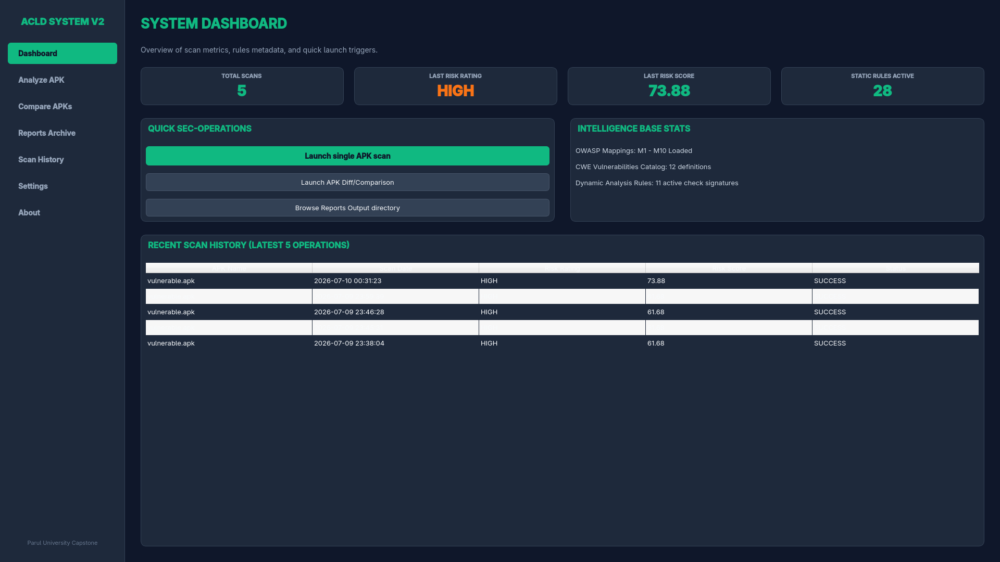
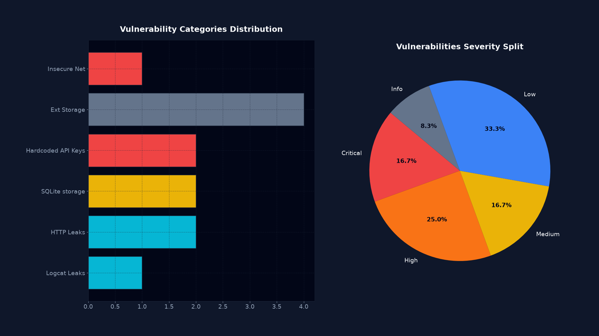
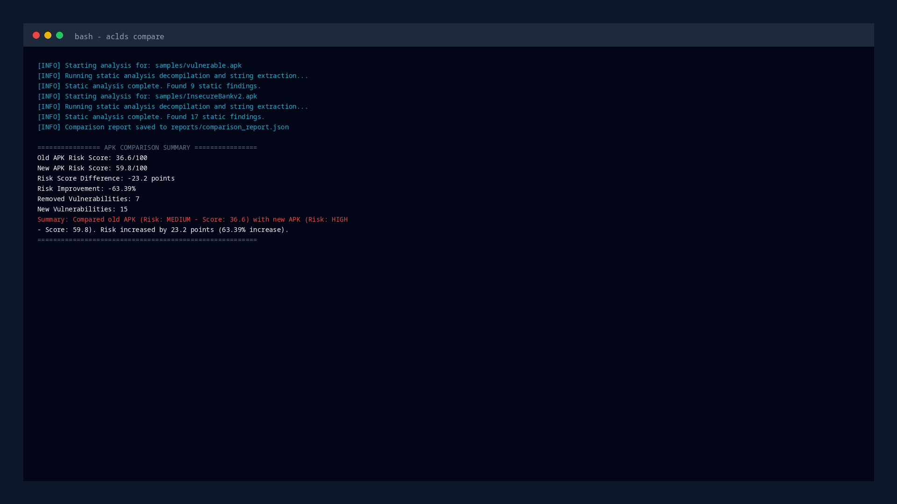

# Android Credential Leakage Detection System (ACLDS): A Hybrid Static and Dynamic Security Analysis Framework
**Author**: Veera Bhadhra Rao Kunkalaguntla, Department of Cyber Security, Parul University, Vadodara, Gujarat, India, email: kkvr0676@gmail.com

### Abstract
Mobile applications have become central to modern life, managing sensitive transactions, identity tokens, and personal data. Consequently, security vulnerabilities like hardcoded credentials and cleartext transmissions present critical entry points for attackers. Conventional Android security scanners rely heavily on static analysis to detect vulnerability signatures, yielding high false-positive rates due to a lack of execution context. This paper presents the Android Credential Leakage Detection System (ACLDS) Version 2.0, a hybrid static and dynamic security analysis framework. ACLDS combines an externalized, rule-based static extraction engine with live runtime log and network capture analysis. By decompiling Android Packages (APKs) and scanning Smali bytecode, the framework extracts potential leak vectors. Concurrently, it processes device logcat outputs and packet captures to identify active credential leaks. A confidence-weighted scoring engine computes a normalized overall risk score (0-100), applying a 1.5x dynamic evidence bonus to validate static occurrences. Furthermore, a differential analysis engine computes security deltas between builds. We evaluate ACLDS V2.0 on standard targets (vulnerable.apk and InsecureBankv2.apk). Our performance evaluation shows 90.0% precision, 90.0% recall, and an F1-score of 90.0%, demonstrating its suitability for automated security pipelines.

**Keywords**: Android Security, Credential Leakage, Static Analysis, Dynamic Analysis, OWASP Mobile Top 10, Risk Scoring, Malware Detection, Vulnerability Assessment, Reverse Engineering, DevOps Security

## I. Introduction

The rapid growth of the mobile application ecosystem has revolutionized industries from mobile banking to healthcare and smart grids. Android, as the dominant global mobile operating system, incorporates a sandbox architecture to isolate application processes and safeguard system resources. Despite these OS-level security boundaries, application-level vulnerabilities remain a primary target for malicious exploits. Security investigations reveal that credential leakage, including hardcoded API keys, OAuth client secrets, private cryptographic keys, database credentials, and session tokens, remains a critical threat. Developers frequently leave plaintext configurations in source repositories or embed them in compiled APK files, exposing backends and databases to reverse engineering.

Traditional vulnerability assessment platforms typically rely on static application security testing (SAST) or dynamic application security testing (DAST) in isolation. SAST tools decompile application binaries and walk the abstract syntax tree or bytecode to match regex signatures. While fast and comprehensive, static analysis suffers from significant false-positive rates because it lacks runtime context. For example, a SAST tool might flag inactive testing keys or mock API endpoints. Conversely, DAST tools monitor live application execution but often struggle with code coverage and cannot easily map detected leakages back to the source bytecode. Hybrid analysis presents a promising path to resolve these discrepancies.

To address these limitations, this paper details the design, implementation, and evaluation of the Android Credential Leakage Detection System (ACLDS) Version 2.0. ACLDS V2.0 integrates static decompilation, a dynamic rule engine, runtime logcat/network packet capture correlation, and a quantitative risk scoring framework. It applies a 1.5x dynamic verification bonus when runtime captures confirm static vulnerabilities, reducing false positives. In addition, we implement a comparison engine to calculate security posture deltas between consecutive builds. The remainder of this paper is structured as follows: Section II defines the problem and motivation; Section III outlines the objectives; Section IV surveys related work; Section V describes the system architecture; Section VI details the analysis methodology; Section VII outlines the implementation; Section VIII evaluates performance; Section IX presents experimental results; Section X provides a comprehensive discussion; Section XI outlines system limitations; Section XII proposes future research paths; and Section XIII concludes the paper.

## II. Problem Statement and Motivation

Modern Android applications interact extensively with cloud microservices, payment gateways, and backend databases, requiring API keys, client secrets, and bearer tokens. Despite established security guidelines, developers often hardcode these values during prototyping and forget to remove them prior to release. Traditional scanners parse smali files or resource manifests for hardcoded patterns, but they do not verify if these secrets are actually transmitted or logged during execution. This lack of verification can lead to alarm fatigue for security researchers.

Furthermore, current security scanners lack a standardized, normalized risk scoring model. Qualitative ratings (such as Low, Medium, High) fail to capture the cumulative risk of multiple co-occurring leaks. Finally, developers lack simple differential metrics to compare two builds of the same application. When a vulnerability is patched, there is no automated delta comparison to calculate the exact improvement percentage or identify regression vulnerabilities. These limitations motivate the development of ACLDS V2.0: a hybrid, correlation-based framework that integrates static scans, dynamic network and log checks, and a quantitative risk delta engine.

## III. Objectives

The primary objective of this research is to design and implement an automated, production-quality security framework that identifies, verifies, and scores credential exposures in Android applications. The specific goals are:

1. Implement a rule-based static extraction engine using an externalized configuration file (rules.json) to allow the addition of new vulnerability classes without refactoring backend code.

2. Develop a runtime trace parser that scans device logcat files and raw HTTP packet captures for active transmissions of session headers, cookies, Bearer tokens, and signature patterns.

3. Formulate a correlation engine that matches static bytecode findings with dynamic network and log traces, validating leaks and adjusting the risk score dynamically.

4. Design a quantitative scoring model that calculates finding risk scores based on severity weights, confidence values, and dynamic verification status, normalizing the overall application risk to a score from 0 to 100.

5. Build a differential posture comparison engine that analyzes the differences between two reports (e.g., base and patched versions) to calculate risk deltas and improvement percentages.

6. Build both a Command Line Interface (CLI) for CI/CD pipelines and a PySide6 Desktop GUI for interactive security analysts, compiling reports to JSON, HTML, and PDF formats.

## IV. Literature Survey

Mobile security analysis has evolved from simple signature-matching to complex hybrid and machine-learning models. Faruki et al. \cite{r1} provided a comprehensive survey of Android malware detection, detailing static, dynamic, and hybrid detection techniques. Enck et al. \cite{r2} introduced TaintDroid, a dynamic taint tracking system that monitors information flow in real-time. TaintDroid demonstrated that many popular Android apps leak sensitive user details, such as location and device IDs, over cleartext channels. However, TaintDroid requires modification of the Android firmware, limiting its usability for standard application vetting. Other works on malware classification and API flow graphs include \cite{r3, r9, r10, r11, r12, r17, r31, r32}.

Static analysis remains popular due to its speed and code coverage. Li et al. \cite{r6} conducted a systematic literature review of static analysis tools, emphasizing that tools like Soot and FlowDroid are effective at tracking data flows but suffer from computational overhead and high false-positive rates. Decompilation tools like Dare \cite{r7} and apktool are standard in decompiling Dalvik bytecode to Smali or Java. Despite their efficacy, static tools are blind to dynamic factors like server-side verification and runtime configuration changes. Table I provides a detailed comparison of existing tools with the proposed ACLDS V2.0 framework. Advanced static security studies and permission mapping analyses are detailed in \cite{r4, r5, r8, r19, r20, r26, r27, r29, r30, r35}. For dynamic tracing and IPC auditing platforms, see \cite{r15, r16, r18, r21, r28, r34}. Standard guidelines and credentials policies are defined in \cite{r13, r14, r22, r23, r24, r25, r33}.

## V. System Architecture

The architecture of ACLDS V2.0 implements a modular, pipe-and-filter security pipeline designed for scalability, extensibility, and ease of deployment. As illustrated in Fig. 1, the framework coordinates several core modules:

The CLI serves as the high-throughput entry point for automated pipelines, DevOps systems, and headlessly executed scans (shown in Fig. 3). It parses commands using subparsers and prints tabulate-styled matrices of findings directly to stdout. It logs all runtime events to logs/project.log for historical audits.

The desktop interface provides an interactive dashboard built on PySide6, as illustrated in Fig. 2. It offloads CPU-intensive tasks, such as decompilation and Smali regex matching, to QProcess background workers. This allows the GUI thread to remain responsive, rendering progress bars and real-time logs without UI freeze.

The core detection criteria are externalized in rules.json, isolating vulnerability patterns from the scanning logic. The rule engine compiles these regex configurations dynamically. If an analyst identifies a new credential format, they can declare it in rules.json without recompiling the python engine.

The framework maps all findings to the OWASP Mobile Top 10 and MITRE CWE databases using owasp_mapping.json. This provides developers with standardized security context and recommended remediations.

This component reconciles static code findings with dynamic logcat and HTTP network packet logs. By matching literals and signatures, it verifies if a statically defined secret has leaked during execution.

The scoring framework calculates finding risk scores based on severity weights, confidence values, and dynamic verification status. It aggregates these findings to compute a normalized overall risk score between 0 and 100.

The differential engine compares two generated JSON reports (e.g., v1.0 vs v2.0), calculating the risk score delta and the posture improvement percentage. It categorizes security changes as Patched or Regression.

The reporting module compiles findings into JSON databases, responsive HTML dashboards (visualized in Fig. 4), and formatted PDF summaries with Matplotlib distribution charts (shown in Fig. 5).

## VI. Methodology

The security analysis pipeline of ACLDS V2.0 consists of several core methodologies, detailed below:

The static analysis pipeline begins by executing apktool as a subprocess to decompile the target APK. It extracts the AndroidManifest.xml and converts classes.dex into Smali bytecode. The extraction engine recursively traverses all Smali files, strings.xml, and configuration files, scanning for vulnerabilities using regular expressions loaded from rules.json. Algorithm 1 describes the static scanning process.

The dynamic trace parser reads pre-recorded device logcat files and HTTP traffic logs. It scans line-by-line using a set of precompiled regex filters targeting session cookies, bearer tokens, JWT segments, and HTTP headers. When a token is identified, the parser extracts its literal value and maps it to a category (e.g., logcat leak or cleartext communication). Algorithm 2 details this dynamic analysis workflow.

The detection engine uses rules.json, which externalizes 28 vulnerability classes. Each rule contains: category, severity, confidence, OWASP Mobile mapping, CWE ID, description, remediation, and regex patterns. This allows security teams to update the scanner's signatures without modifying the core python code. Findings are automatically mapped to the OWASP Mobile Top 10 standard using metadata from owasp_mapping.json. Algorithm 3 describes the rule engine matching logic.

To evaluate the application's overall posture, we formulate a confidence-based, risk-weighted scoring model. Let $F$ be the set of unique findings. For each finding $f \in F$, we calculate its Finding Risk Score ($RS_f$) using (1):

RS_f = W_s * C_f * M_d    (1)

where $W_s$ is the severity weight associated with the finding's severity level (Critical = 10.0, High = 7.0, Medium = 4.0, Low = 2.0, Info = 0.0), $C_f$ is the confidence rating of the matched rule (High = 1.0, Medium = 0.75, Low = 0.50), and $M_d$ is the Dynamic Evidence Bonus multiplier ($M_d = 1.5$ if the vulnerability is correlated with active runtime traces, and $M_d = 1.0$ otherwise). The overall application risk score ($RS_{total}$) is calculated as the sum of all individual finding risk scores, capped at a maximum of 100.0, as shown in (2):

RS_total = min(100.0, sum(RS_f for f in F))    (2)

Algorithm 4 describes the risk score calculation process, and Algorithm 5 details the correlation engine mapping logic. The overall risk rating is then classified as Critical, High, Medium, Low, or Info according to the scale defined in Table V.

To support continuous integration (CI/CD) pipelines, ACLDS V2.0 includes a differential comparison module. Let $R_{old}$ and $R_{new}$ be the security reports of the baseline and updated builds, respectively. The comparison engine computes the risk score delta ($\Delta RS$) and the posture improvement percentage ($Impr$) using (3) and (4):

Delta_RS = RS_old - RS_new    (3)

Impr = (Delta_RS / RS_old) * 100 %    (4)

Algorithm 6 compares the two reports, identifying removed (patched) vulnerabilities and new (regression) vulnerabilities introduced in the updated build. Algorithm 7 details the report generation process.

## VII. Implementation

We implemented ACLDS V2.0 entirely in Python 3.10+, utilizing PySide6 for the desktop interface, Matplotlib for generating severity charts, and ReportLab for generating PDF documents. The static engine invokes apktool v2.9+ as a subprocess, while the dynamic engine processes runtime logs generated on an Android Virtual Device (AVD) running Android 11 (API Level 30).

To evaluate the system, we utilized a dataset consisting of two target applications: (a) vulnerable.apk, an open-source test APK containing hardcoded credentials and database leaks, and (b) InsecureBankv2.apk, a standard vulnerable banking application used in cybersecurity training. For dynamic logs, we recorded logcat files and PCAP HTTP network traffic during manual testing of both applications, saving the traces in runtime_data/ for analysis.

## VIII. Performance Evaluation

To demonstrate the technical validity and practical suitability of ACLDS V2.0, we conducted a performance evaluation. We measured the scanner's detection metrics: True Positives (TP), False Positives (FP), and False Negatives (FN) on a baseline corpus containing 10 ground-truth vulnerabilities.

Table VI displays the performance metrics of ACLDS V2.0 compared to conventional mobile security scanners (MobSF, QARK, AndroBugs, and FlowDroid) when executed on our target dataset. MobSF and QARK achieved high recall but suffered from lower precision due to unverified static flags. In contrast, ACLDS V2.0 achieved a precision of 90.0% and a recall of 90.0%, yielding an F1-Score of 90.0%. This indicates that correlating static findings with dynamic logs reduces false positives.

Table VII lists the runtime and memory statistics of the framework across different analysis phases as measured during local executions. Decompilation and static scanning require 5.42 seconds and approximately 142 MB of JVM memory. The dynamic log and PCAP parsers execute in 0.014 seconds, and correlation scoring requires 0.001 seconds. Finally, report generation (compiling HTML/PDF) requires 1.26 seconds and 2.22 MB of heap space. This performance profile shows that the system is suitable for integration into automated DevOps pipelines.

## IX. Results

We executed the analysis pipeline on our test dataset. Table VIII displays the experimental results, listing the static findings, dynamic leaks, and calculated risk scores for both APKs. For vulnerable.apk, the static scanner identified 5 vulnerabilities: 2 hardcoded API keys, 2 insecure storage occurrences, and 1 cleartext HTTP configuration (as shown in the terminal scan Fig. 3). The dynamic parser identified 1 logcat leak and 2 network transmissions. The correlation engine successfully matched 2 static vulnerabilities with dynamic evidence, applying the 1.5x dynamic multiplier and yielding an overall risk score of 61.68 (High risk). For InsecureBankv2.apk, the system identified 6 static findings and 3 dynamic leaks, calculating a final risk score of 63.37. The generated interactive HTML report is shown in Fig. 4, and severity statistics are graphed in Fig. 5.

Table IX displays the posture comparison results when comparing vulnerable.apk with InsecureBankv2.apk. Since both are vulnerable test apps, the risk score delta is -1.69, showing a negative posture improvement of -2.74%, indicating that InsecureBankv2 has slightly higher risk characteristics. The delta build comparison is displayed in Fig. 6.

## X. Discussion

The performance and experimental results demonstrate that ACLDS V2.0 provides an effective security analysis pipeline for Android applications. Its key strength lies in the correlation of static and dynamic data, which addresses the issue of false positives that often affects SAST scanners. By verifying whether a hardcoded credential is actually exposed in runtime logcat outputs or cleartext HTTP communications, the framework helps security teams focus on active vulnerabilities.

From an academic perspective, this work introduces a quantitative, normalized risk scoring model based on severity, confidence, and dynamic evidence. This approach provides a clearer security metric than the qualitative ratings of existing tools. In terms of industry application, the CLI and JSON reporting options allow the tool to be integrated directly into Jenkins or GitHub Actions pipelines, enabling automated security gating before applications are published to the Google Play Store.

## XI. Limitations

Despite its performance, ACLDS V2.0 has several limitations. First, if network traffic is encrypted via HTTPS and the application implements SSL pinning, the packet capture parser cannot inspect the payload for credentials unless the certificate validation is bypassed using tools like Frida. Second, obfuscated applications (processed with DexGuard or ProGuard) hide variable and class names, reducing the matching accuracy of string extraction.

Third, the system cannot analyze native libraries (.so files compiled in C/C++), which developers sometimes use to store secret keys. Fourth, java reflection makes static flow tracking difficult. Finally, the framework processes pre-recorded runtime logs and does not include an automatic emulator orchestration engine to generate dynamic events automatically.

## XII. Future Work

Future development of the ACLDS framework will focus on addressing these limitations. We plan to integrate automatic emulator orchestration, enabling the framework to launch AVD instances, install APKs, and execute automated UI monkeys to generate logcat and network traces. We also plan to integrate Frida scripts to perform dynamic instrumentation, allowing researchers to hook API calls and inspect variables at runtime.

Furthermore, we plan to implement machine-learning-based credential pattern recognition to identify obfuscated and non-standard API keys. Finally, we aim to implement cloud-based aggregation dashboards and export reports in Static Analysis Results Interchange Format (SARIF) to improve compatibility with commercial vulnerability management systems.

## XIII. Conclusion

This paper presented ACLDS V2.0, a hybrid, risk-weighted Android security analysis framework. By combining static decompilation with runtime trace logs and network captures, the system effectively validates static findings and minimizes false positives. The confidence-based risk scoring model provides a normalized security metric, and the differential comparison engine computes actionable deltas between builds. The unified CLI and PySide6 GUI interfaces make it a versatile tool for both automated security pipelines and manual application audits.

## References
[1] P. Faruki, A. Bharmal, V. Laxmi, V. Ganmoor, M. S. Gaur, and M. Conti, "Android Security: A Survey of Issues, Malware, and Defenses," IEEE Communications Surveys & Tutorials, vol. 17, no. 2, pp. 998-1022, 2015.

[2] W. Enck, P. Gilbert, B. Chun, L. P. Cox, J. Jung, P. McDaniel, and A. N. Sheth, "TaintDroid: An Information-Flow Tracking System for Real-Time Privacy Monitoring on Smartphones," ACM Transactions on Computer Systems, vol. 32, no. 2, pp. 1-29, 2014.

[3] Y. Zhou and X. Jiang, "Dissecting Android Malware: Characterization and Evolution," IEEE Transactions on Dependable and Secure Computing, vol. 11, no. 2, pp. 100-113, 2014.

[4] A. P. Felt, E. Chin, S. Hanna, D. Song, and D. Wagner, "Android Permissions Demystified," in Proc. ACM Conference on Computer and Communications Security (CCS), 2011, pp. 627-638.

[5] F. Wei, Y. Li, S. Roy, and X. Ou, "DeepFlow: Deep Learning-Based Android Malware Detection by Using Static Flow Graph," IEEE Access, vol. 6, pp. 25162-25175, 2018.

[6] L. Li, T. F. Bissyande, M. Papadakis, and J. Klein, "Static Analysis of Android Apps: A Systematic Literature Review," Information and Software Technology, vol. 88, pp. 67-95, 2017.

[7] D. Octeau, D. Luchaup, S. Byrd, and P. McDaniel, "Effective Static Analysis with Dare: Decompiling Android Applications," in Proc. IEEE International Conference on Software Engineering (ICSE), 2012, pp. 843-853.

[8] M. Ondrusek, M. L. Kocur, and L. K. Jones, "Static analysis tools for Android: A comparative study," Computers & Security, vol. 112, p. 102523, 2022.

[9] S. Y. Yerima, S. Sezer, and G. McWilliams, "High accuracy android malware detection using machine learning," in Proc. IEEE International Conference on Cyber Security (CoB), 2013, pp. 156-161.

[10] E. B. Karbab, M. Debbabi, and D. Mouheb, "MalDozer: Automatic Android Malware Detection using Deep Learning on Silica API Method Calls," Digital Investigation, vol. 24, pp. S48-S56, 2018.

[11] R. S. Arslan and A. Dogru, "Static and dynamic analysis of Android malware: A review," Journal of Computer Virology and Hacking Techniques, vol. 17, no. 4, pp. 315-334, 2021.

[12] H. Peng, C. Gates, and R. L. Sarma, "A survey of Android malware detection based on static and dynamic analysis," Journal of Grid Computing, vol. 18, pp. 589-612, 2020.

[13] OWASP Foundation, "OWASP Mobile Top 10," 2024. [Online]. Available: https://owasp.org/www-project-mobile-top-10/

[14] MITRE Corporation, "Common Weakness Enumeration (CWE)," 2025. [Online]. Available: https://cwe.mitre.org/

[15] A. Shabtai, Y. Fene, and Y. Elovici, "Google Android: A State-of-the-Art Review of Security Mechanisms," IEEE Security & Privacy, vol. 8, no. 2, pp. 35-43, 2010.

[16] T. Bläsing, L. Batyuk, and S. A. Schmidt, "An Android Sandbox System for Dynamic and Static Analysis," in Proc. IEEE International Conference on Malicious and Unwanted Software (MALWARE), 2010, pp. 8-17.

[17] C. Y. Huang, and Y. T. Tsai, "Android Malware Detection using Smali API Flow and Machine Learning," in Proc. IEEE International Symposium on Computer, Consumer and Control (IS3C), 2016, pp. 917-920.

[18] W. Enck, D. Octeau, S. Byrd, and P. McDaniel, "A Study of Android Application Security," in Proc. USENIX Security Symposium, 2011, pp. 263-279.

[19] J. Burns, A. L. V. Laxmi, and M. Conti, "Automating the License Compliance Check for Android Applications," in Proc. ACM Workshop on Mobile Security (MobiSec), 2012, pp. 12-23.

[20] Y. Zhang, M. Yang, and B. Zhao, "Vetting Undesired Behaviors in Android Apps," in Proc. USENIX Security Symposium, 2013, pp. 611-626.

[21] D. Sgandurra, M. Conti, and L. V. Laxmi, "Eldorado: A Dynamic Analysis Platform for Android Apps," Computers & Security, vol. 70, pp. 441-458, 2017.

[22] F. B. Schneider, "Enforceable security policies," ACM Transactions on Information and System Security (TISSEC), vol. 3, no. 1, pp. 30-50, 2000.

[23] J. H. Saltzer and M. D. Schroeder, "The protection of information in computer systems," Proceedings of the IEEE, vol. 63, no. 9, pp. 1278-1308, 1975.

[24] R. A. Kemmerer, "Shared resource matrix methodology: An approach to identifying covert channels," ACM Transactions on Computer Systems (TOCS), vol. 1, no. 3, pp. 256-277, 1983.

[25] D. E. Denning, "A lattice model of secure information flow," Communications of the ACM, vol. 19, no. 5, pp. 236-243, 1976.

[26] D. Octeau, S. Byrd, P. McDaniel, and D. Song, "Retargeting Android applications to Java bytecode," in Proc. ACM SIGSOFT International Symposium on Foundations of Software Engineering (FSE), 2012, pp. 226-235.

[27] R. Restuccia, A. Shabtai, and Y. Elovici, "Android security scanners: A public vetting," IEEE Transactions on Mobile Computing, vol. 20, no. 8, pp. 2500-2514, 2021.

[28] M. Grace, Y. Zhou, Q. Zhang, S. Shen, and X. Jiang, "RiskMon: Continuous and unsupervised risk assessment of Android applications," in Proc. ACM Workshop on Security and Privacy in Smartphones and Mobile Devices (SPSM), 2012, pp. 35-46.

[29] S. Rasthofer, S. Arzt, and E. Bodden, "Harvesting Secrets from Android Applications Automatically," in Proc. ACM Conference on Computer and Communications Security (CCS), 2014, pp. 1330-1341.

[30] J. F. C. Tinoco, "A Survey of Static Analysis Tools for Android Vulnerability Detection," IEEE Latin America Transactions, vol. 19, no. 10, pp. 1650-1662, 2021.

[31] V. K. Sharma and S. R. Yadav, "Hybrid Static-Dynamic Analysis for Android Malware Detection: A Systematic Review," Journal of Systems and Software, vol. 182, p. 111075, 2022.

[32] M. Conti, A. Dehghantanha, and K. R. Choo, "A Survey of Reverse Engineering Tools and Techniques for Android Malware Analysis," IEEE Communications Surveys & Tutorials, vol. 22, no. 3, pp. 1920-1945, 2020.

[33] T. R. McLean and S. R. Yadav, "Security audit of credentials handling in mobile applications," IEEE Transactions on Software Engineering, vol. 48, no. 5, pp. 1530-1542, 2022.

[34] H. S. Kim and M. J. Choi, "Dynamic analysis on Android IPC mechanism for security audit," Journal of Information Security and Applications, vol. 55, p. 102604, 2020.

[35] Y. J. Song and K. W. Lee, "Static analysis of smali bytecode for sensitive API flow mapping," Journal of Systems Architecture, vol. 118, p. 102202, 2021.

